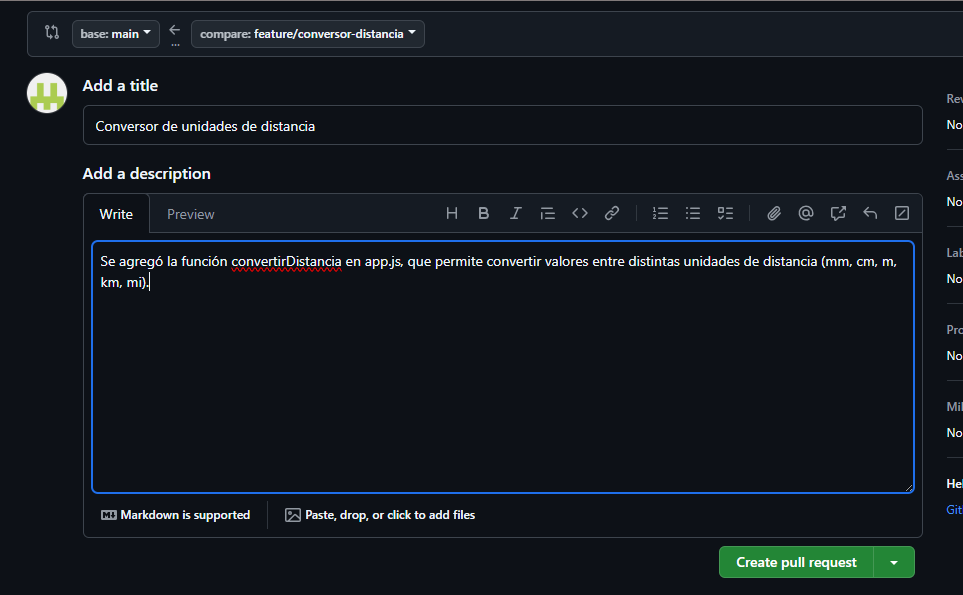
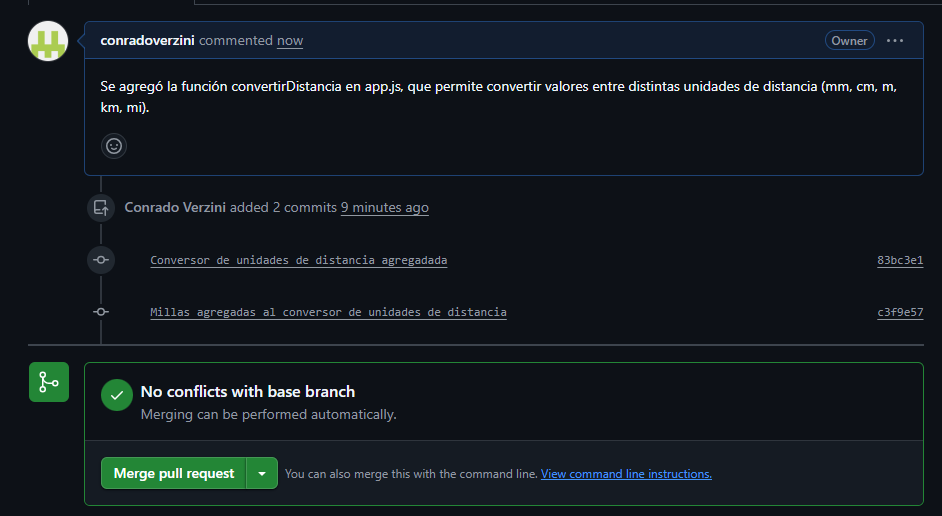
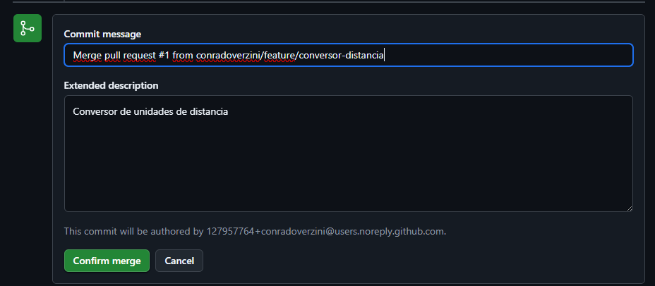
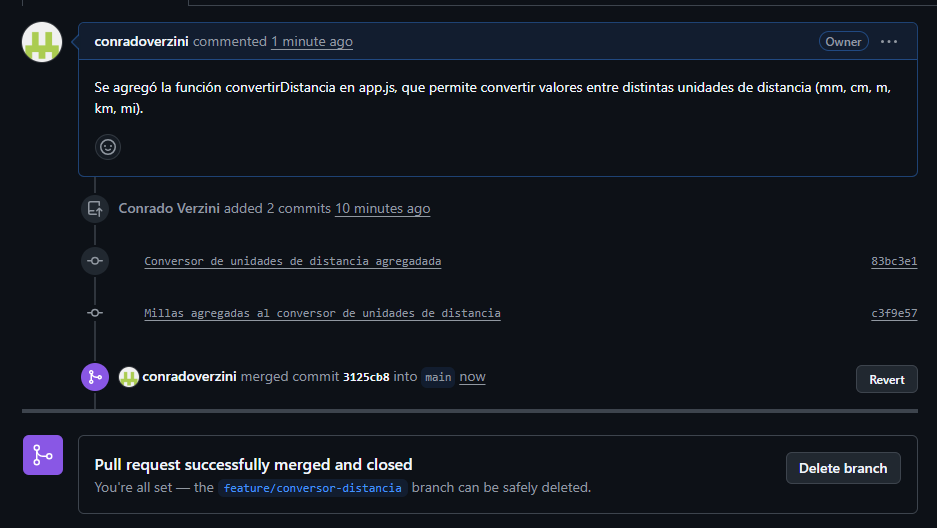
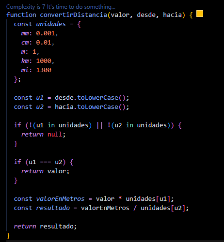
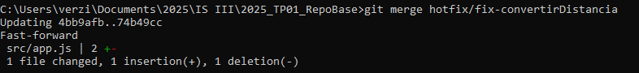

# **Trabajo Práctico 1**
## GIT Basico

Primero forkeamos el repositorio base y luego clonamos ese mismo en una carpeta local:

https://github.com/ingsoft3ucc/2025_TP01_RepoBase

Luego configuramos nuestra identidad, con los siguientes comandos:

git config user.name "Conrado Verzini"
git config user.email "2215019@ucc.edu.ar"

Esto asegura la trazabilidad dando a conocer el autor de cada cambio.

## Desarrollar una funcionalidad y abrir una PR

Para desarrollar una funcionalidad creamos una rama separada de main, haciendo lo siguiente:

- git branch feature/conversor-distancia
- git checkout feature/conversor-distancia

Luego pusheamos la rama creada al repositorio remoto:

git push -u origin feature/conversor-distancia

Creamos una función en el archivo app.js llamada convertirDistancia, que permite convertir un valor entre distintas unidades de distancia, como milímetros, centímetros, metros, kilómetros. 

- git add .
- git commit -m "Conversor de unidades de distancia agregadada"
- git push origin feature/conversor-distancia

Luego tambien nos pareció buena idea que esa función permita la conversión a millas y viceversa. Por lo que, agregamos eso e hicimos otro commit:

- git add .
- git commit -m "Millas agregadas al conversor de unidades de distancia"
- git push origin feature/conversor-distancia

Hicimos esos commits porque consideramos que son atómicos y cuentan con una descripción clara de lo realizado.

Luego en Github, abrimos una PR desde la rama feature/conversor-distancia hacia el main del repositorio forkeado, para solicitar que los cambios realizados en la rama feature/conversor-distancia se mergeen con la rama main.

Una vez creada la PR, revisamos la petición y al no haber conflictos, realizamos el merge. 

Esto da como resultado la integración de la rama feature/conversor-distancia con la main.

## Simulacion del Error

En la rama main, simulamos un error en el calculo de km a millas, como se ve a continuacion:

Y pusheamos eso al repositorio en el Github:

- git add src/app.js
- git commit -m "Error simulado calculo de millas"
- git push origin main

Luego creamos la rama hotfix/fix-convertirDistancia para solucionar ese error. Una vez que lo solucionamos, hacemos el commit:

git add src/app.js
git commit -m "Error en convertirDistancia corregido"

Luego procedemos a hacer merge de forma local. Posicionados sobre la rama main (git checkout main) hacemos lo siguiente:

- git merge hotfix/fix-convertirDistancia

Como no hubo ningún error a la hora de hacer el merge, pusheamos el error corregido al repositorio remoto.

De igual manera procedemos con la rama feature/conversor-distancia, para que todas las ramas estén alineadas con la version corregida de main. De lo contrario, si se quisiera fusionar feature/conversor-distancia a main podrían aparecer conflictos innecesarios o incluso reintroducir el error previamente corregido en hotfix/fix-convertirDistancia. Para esto:

- git checkout feature/conversor-distancia
- git merge hotfix/fix-convertirDistancia
- git push origin feature/conversor-distancia

Usamos merge para integrar el fix porque permite conservar el historial completo de los cambios y entender mejor el contexto en que fueron hechos.

## Creación de versión etiquetada

Sobre la main (git checkout main), marcamos la versión estable con:

- git tag -a v1.0 -m "Version estable 1.0"
- git push origin v1.0 

El -a crea un tag anotado, lo que permite guardar el mensaje, autor, fecha y el commit exacto.

Se utilizó la convención de versionado semántico (SemVer), un estándar común en el desarrollo de software que asigna versiones siguiendo el formato MAJOR.MINOR.PATCH.

- MAJOR se incrementa cuando hay cambios que rompen compatibilidad.
- MINOR cuando se agregan nuevas funcionalidades sin afectar lo anterior.
- PATCH para correcciones menores o ajustes internos.

En este caso, se creó la etiqueta v1.0 para marcar la primera versión estable del proyecto. No se usaron valores de minor ni patch porque esta versión inicial define el punto de partida del sistema.

## Errores o dudas a la hora de realizar el TP:

#### Primer push de rama nueva:
Al intentar pushear la rama feature/conversor-distancia por primera vez, Git pidió configurar un upstream. Para eso usamos:
- git push -u origin feature/conversor-distancia
Esto estableció la rama remota y permitió futuros pushes sin problemas.

#### Confusión sobre PR:
Al principio no estábamos seguros de si debíamos abrir la PR al repositorio base, es decir, al main de "ingsoft3ucc/2025_TP01_RepoBase". Pero luego entendimos que era al main del repositorio forkeado.

## Resumen de calidad y trazabilidad en un equipo real

- Flujo de ramas organizado: mantener main siempre estable, usar feature/* para nuevas funcionalidades y hotfix/* para correcciones urgentes.

- Commits atómicos: cada commit debe ser pequeño, con un propósito claro y mensaje descriptivo.

- Revisión con PRs: todos los cambios se integran a través de PRs, que permiten comentarios y validación antes de llegar a main.

- Versionado semántico con tags: marcar versiones estables para facilitar retrocesos o referencias a estados del proyecto.

- Llevar una documentación de los cambios.

